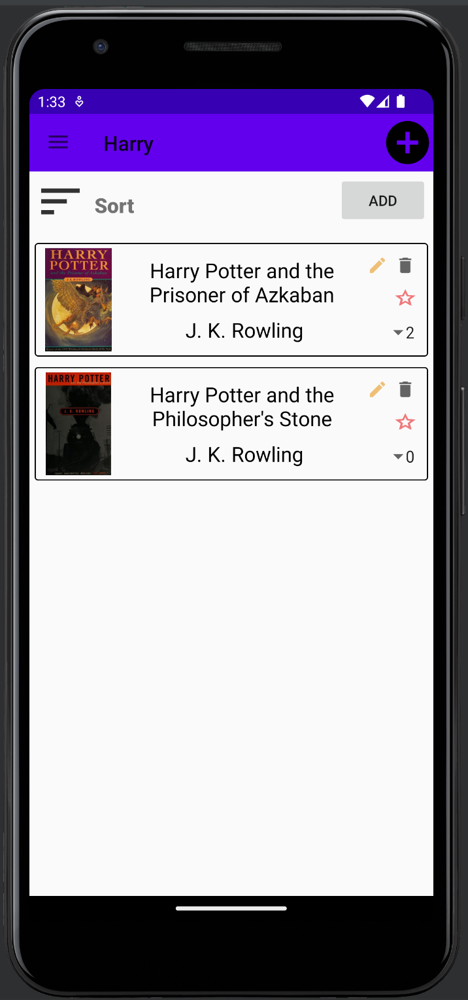
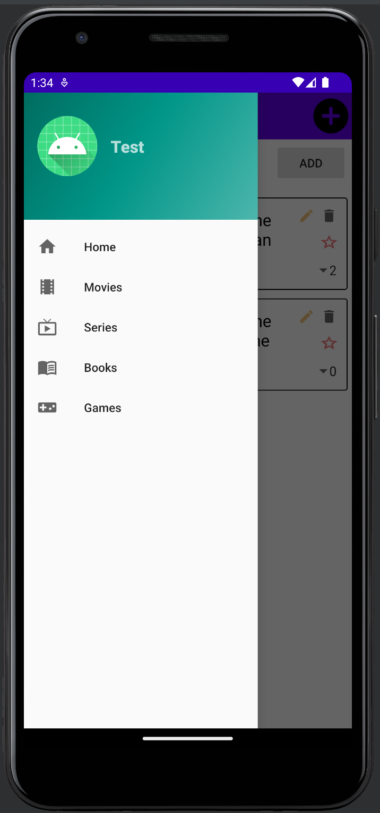

# List in Time
## Introduction
This android app lets you create, fill, sort, and maintain lists of your favorite media
directly on your phone.

:-------------------------:|:-------------------------:
             |  

## Features
1. Create various profiles with their own set of lists.

2. Create and name a list of games, books, tv series, or movies.

3. Fill a list by searching from databases on the internet.

4. A multitude of actions for tailoring each item on your list such as 
   adding a comment, setting as favorite, deleting, and giving it a score.

5. Various sorting options to better visualize your existing lists.  

## Information
This software was made within the context of a last year fostware engineering class l'UQAM.

Made with Gradle and for Android 11.0/12.0

## Credit
This project was made by a group of 3 people:

*Alexandre St-Pierre*

*Gael de Oliveira*

*Julien Champagne*
